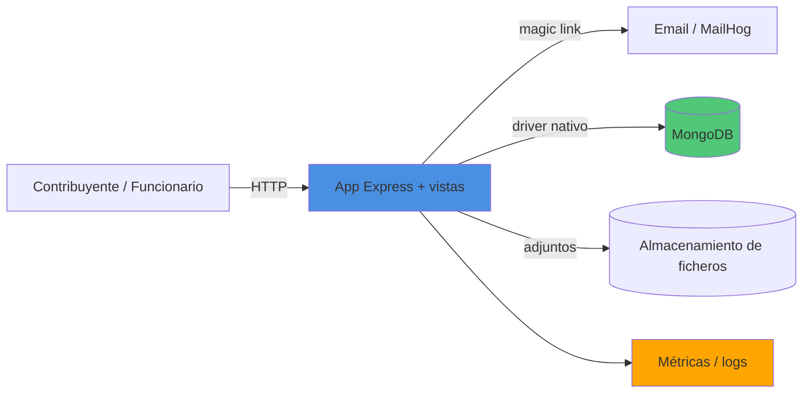

# Registro Municipal

SaaS de registro de entrada y tramitación para ayuntamientos. Los **contribuyentes**
presentan documentos (instancia general) y los **funcionarios** los tramitan mediante
**expedientes** y **actuaciones**. Multi-área: cada área de gestión tiene su home y sus
funcionarios.

> Especificación completa: [`PROMPT.md`](PROMPT.md) · Guía operativa: [`AGENTS.md`](AGENTS.md)

## Características (MVP)
- Autenticación sin contraseña por **magic link**.
- Roles **contribuyente** y **funcionario**.
- Presentación de **instancia general** con adjuntos.
- Expedientes y actuaciones para la tramitación.
- Home personalizable por **área de gestión** (SaaS).

## Stack
Node.js + Express · MongoDB (driver nativo) · magic link · Playwright (e2e).

## Instalación rápida
Ver [`QUICKSTART.md`](QUICKSTART.md). Resumen:
```bash
npm install
cp .env.example .env
npm run seed
npm run dev
```

## Arquitectura
<!-- TODO: revisar al implementar; refleja PROMPT.md §3/§6 -->


## Scripts
<!-- TODO: completar cuando exista package.json -->
| Comando | Descripción |
|---|---|
| `npm run dev` | Arranque en desarrollo |
| `npm test` | Tests unit + integración |
| `npm run test:e2e` | Tests e2e (Playwright) |
| `npm run seed` | Datos de ejemplo |

## Documentación
- [`PROMPT.md`](PROMPT.md) — qué hace el producto (especificación).
- [`AGENTS.md`](AGENTS.md) — cómo se instala, arranca y despliega.
- [`RETROSPECTIVA.md`](RETROSPECTIVA.md) — incidencias y soluciones.
- [`REFLEXION-FINAL.md`](REFLEXION-FINAL.md) — cierre del proyecto.
